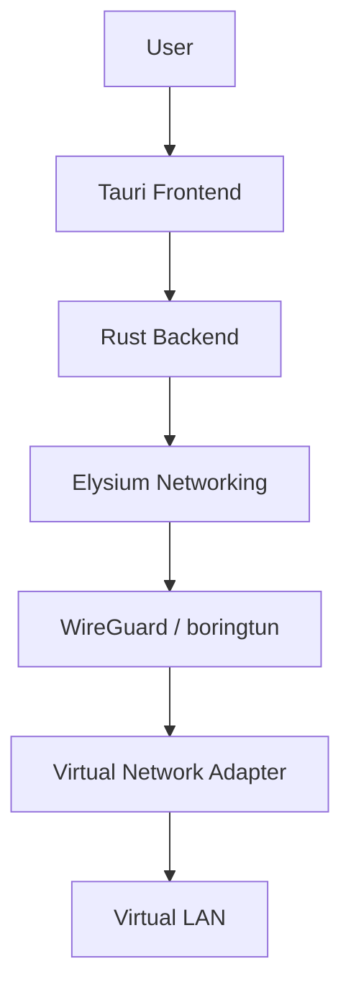

# Elysium

A high-performance peer-to-peer virtual LAN designed primarily for gaming and low-latency private networking.

## Architecture

Elysium creates a virtual subnet (e.g., `10.7.0.0/24`) and connects peers securely using a decentralized model.



## Features

- **Decentralized Network:** Peer-to-peer connection without central game servers.
- **Security First:** Utilizes the WireGuard protocol for encrypted communication.
- **NAT Traversal:** Built-in connection negotiation to bypass strict NAT environments.

## Status

Elysium is currently under active development.

## Supported Platforms

- Windows (Tested)
- Other platforms (Work in progress)

## Documentation

- [Threat Model](docs/THREAT_MODEL.md)
- [Security Architecture](docs/SECURITY_ARCHITECTURE.md)
- [Performance Policy](docs/PERFORMANCE.md)

## Development Setup

To build Elysium from source:

### Prerequisites

- Rust (latest stable)
- Node.js (v18+)
- Tauri prerequisites (C++ Build Tools on Windows)

### Build Instructions

1. Clone the repository.
2. Install frontend dependencies:
   ```bash
   npm install
   ```
3. Run the development environment:
   ```bash
   npm run dev
   ```
4. Build for production:
   ```bash
   npm run build
   ```
